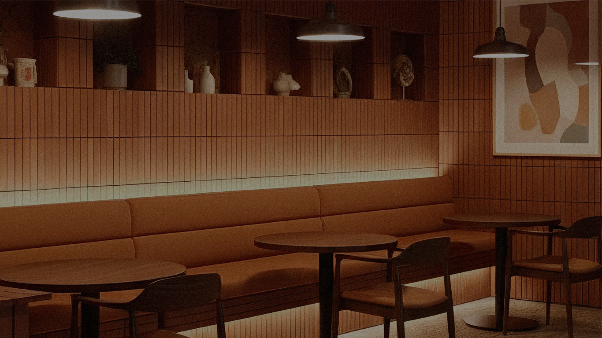

<div align="center">

  

  # ☕ Morra Coffee Shop Website

  <p>
    Website Coffee Shop modern yang responsif, cepat, dan terintegrasi dengan Payment Gateway.
    <br>
    Dibangun dengan teknologi ringan tanpa build-tools yang rumit.
  </p>

  <p>
    
    
    
    
    
  </p>

  [Demo](#) • [Fitur](#fitur-unggulan) • [Instalasi](#panduan-instalasi) • [Konfigurasi](#konfigurasi-pembayaran)

</div>

---

## 📸 Tampilan (Screenshots)

| Halaman Utama | Menu & Keranjang |
|:---:|:---:|
|  | *Ganti dengan screenshot menu/cart anda* |

> *Ganti gambar di atas dengan screenshot asli website Anda agar lebih menarik!*

---

## ✨ Fitur Unggulan

* **⚡ Reactive UI:** Menggunakan **Alpine.js** untuk interaksi keranjang belanja yang cepat tanpa reload halaman.
* **🎨 Modern Design:** Styling menggunakan **Tailwind CSS** yang responsif (Mobile Friendly).
* **🛒 Smart Cart:**
    * Tambah/Kurang item dengan perhitungan otomatis.
    * Hapus item otomatis jika quantity 0.
    * Catatan khusus per item (misal: *less sugar*).
* **🔍 Search & Filter:** Pencarian menu realtime dan filter berdasarkan kategori (Kopi, Makanan, Dessert).
* **💳 Midtrans Payment:** Integrasi pembayaran otomatis (QRIS, GoPay, Transfer Bank) menggunakan Snap Popup.
* **🔒 Secure Backend:** Logika pembayaran ditangani di sisi server (PHP) untuk keamanan transaksi.

---

## 📂 Struktur Folder

```text
morra-coffee/
├── assets/
│   └── images/          # Aset gambar produk & logo
├── php/
│   ├── midtrans-php/    # Library Midtrans
│   ├── placeOrder.php   # Logika Backend Transaksi
│   └── config.php       # (Di-ignore git) Konfigurasi Server Key
├── src/
│   └── app.js           # Logika Frontend (Alpine.js)
├── index.html           # Halaman Utama
└── README.md            # Dokumentasi
